🏛️ Amar Prokolpo - Government Schemes Portal
Amar Prokolpo is a production-ready, full-stack ecosystem designed to bridge the gap between citizens and government welfare schemes. This project includes a high-performance backend, two specialized web frontends (User & Admin), and a native mobile application.

#Admin Panel 

# Mobile APP

.jpeg)

.jpeg)
.jpeg)

.jpeg)
.jpeg)

.jpeg)

.jpeg)
.jpeg)

# Web Site 
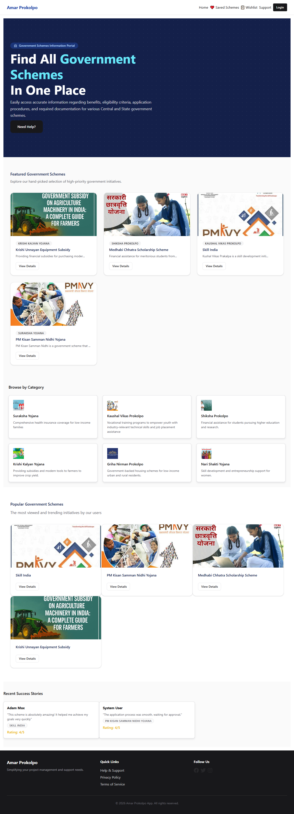
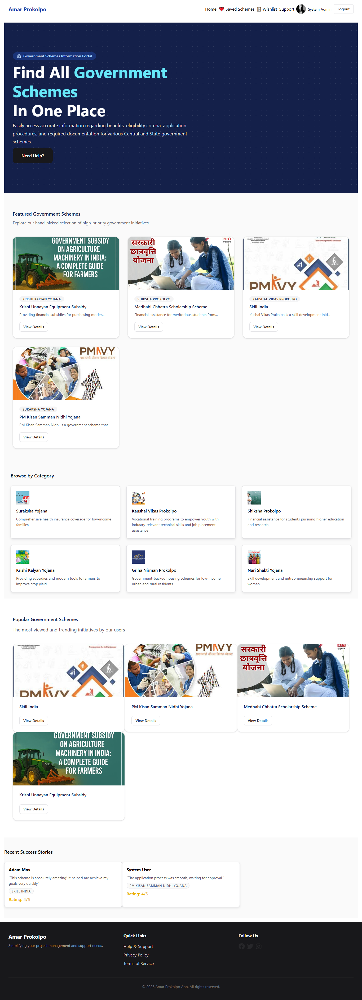
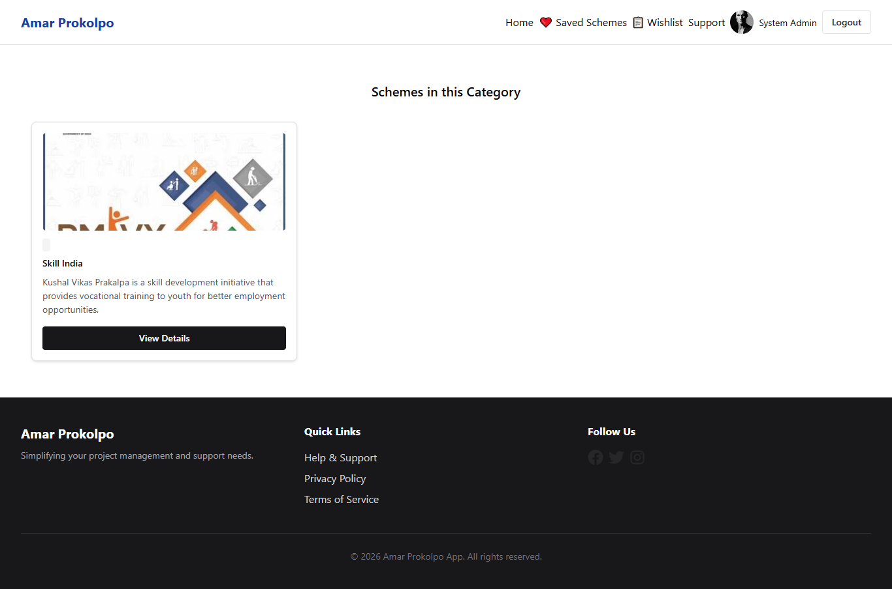
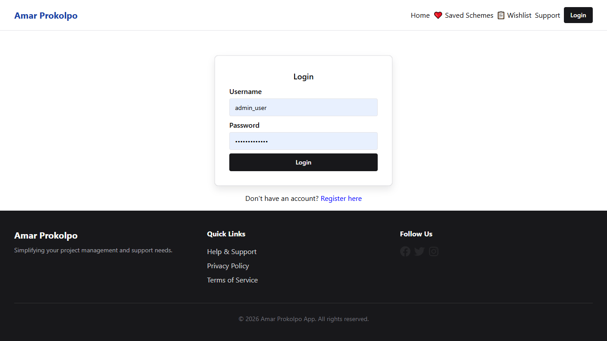
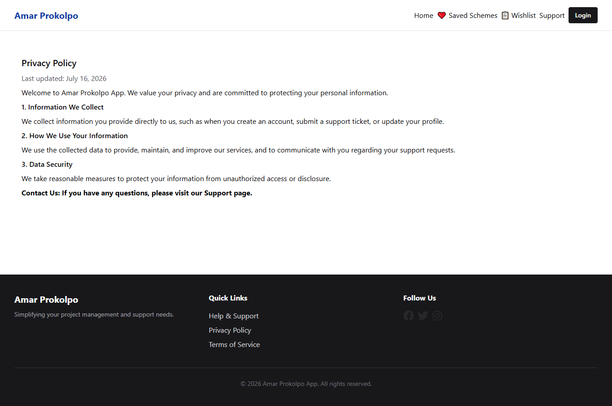
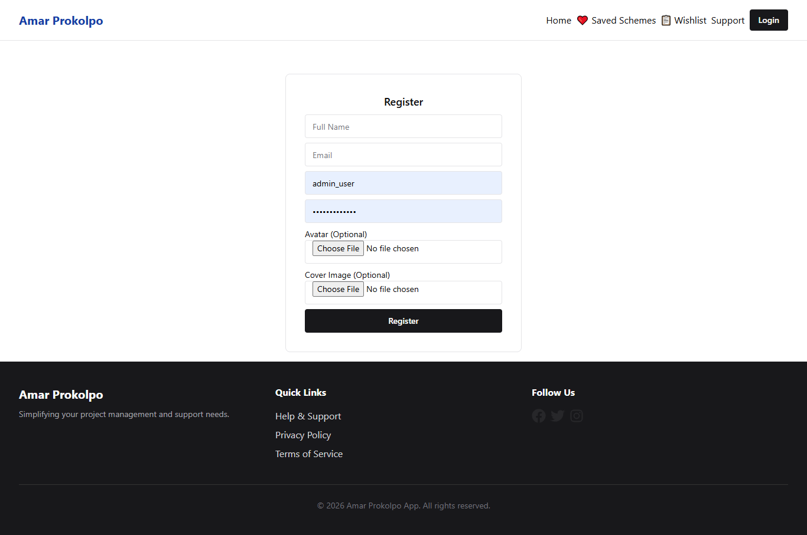

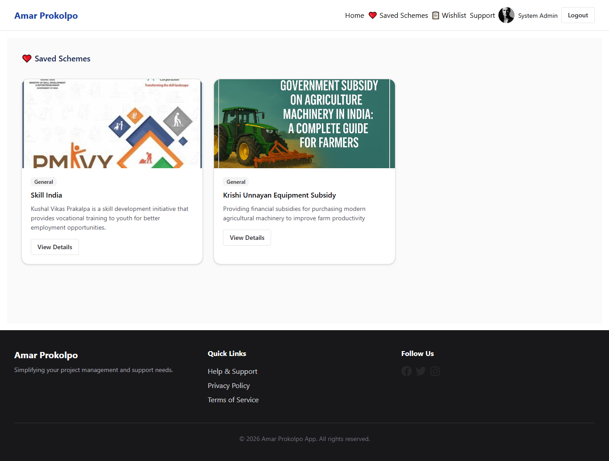
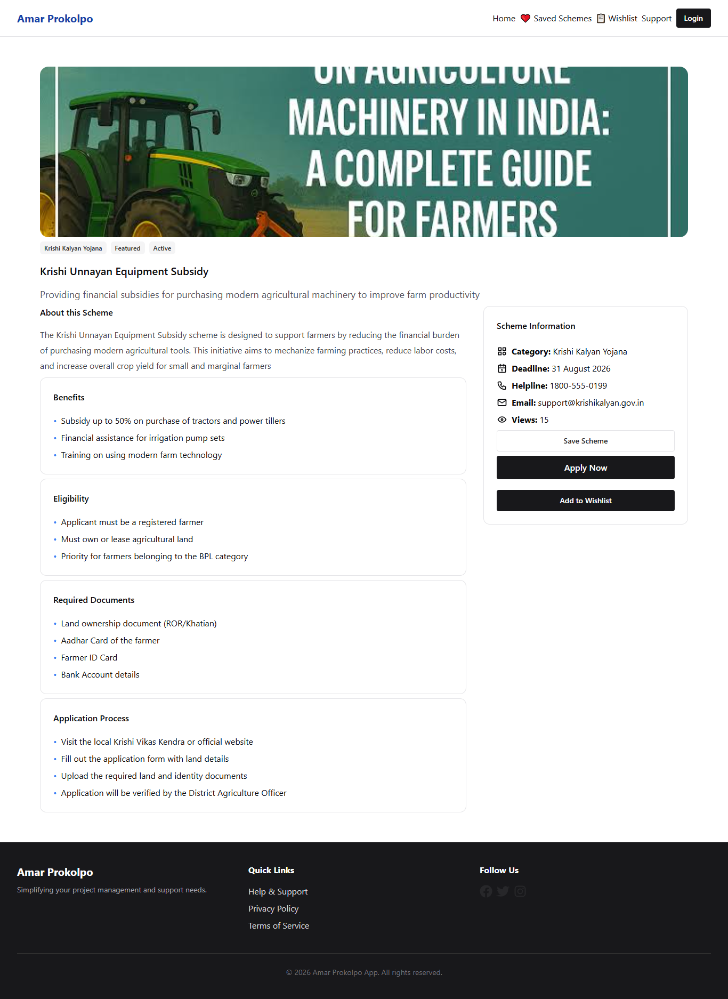
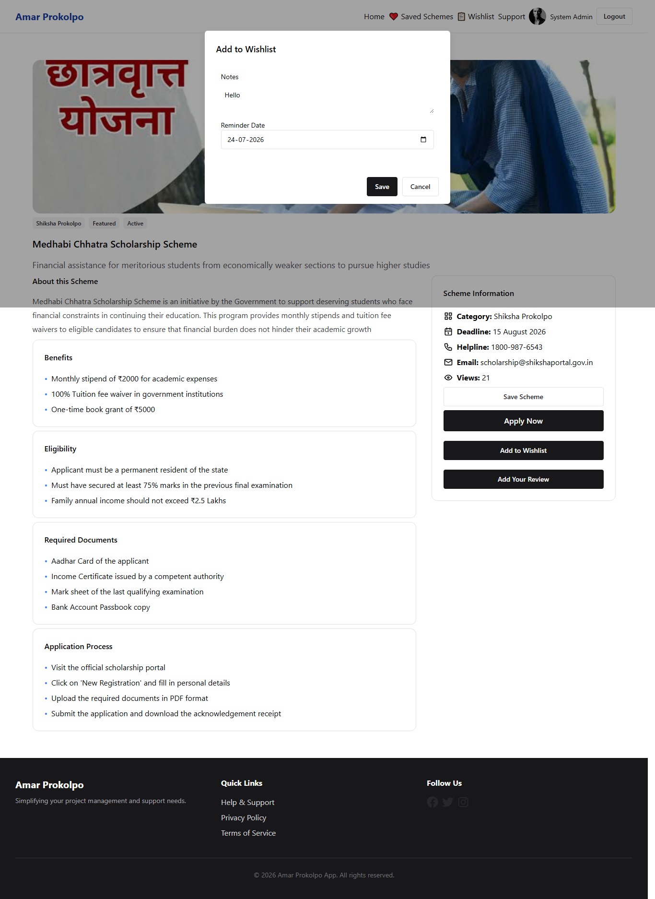
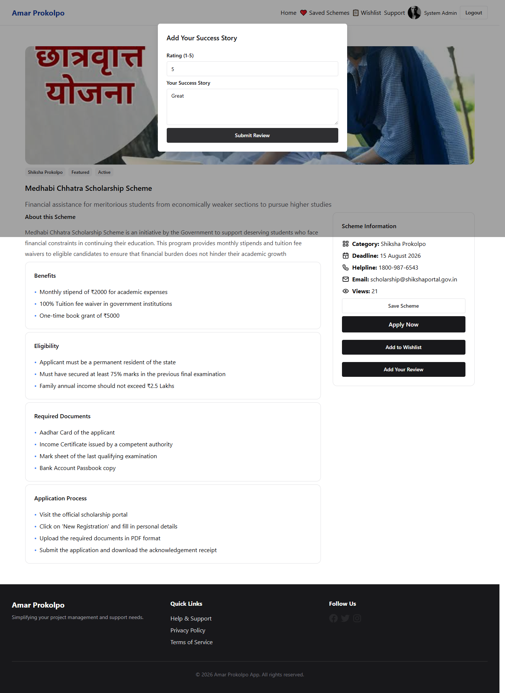
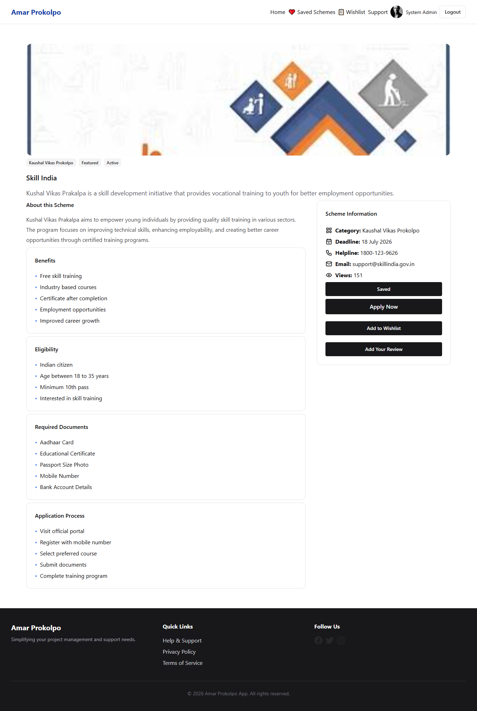
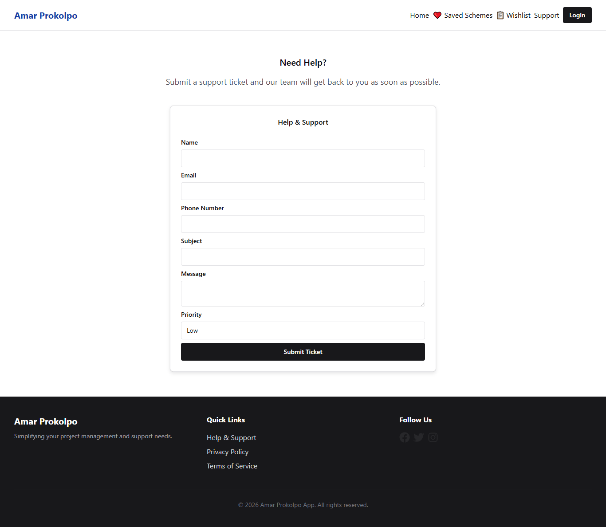
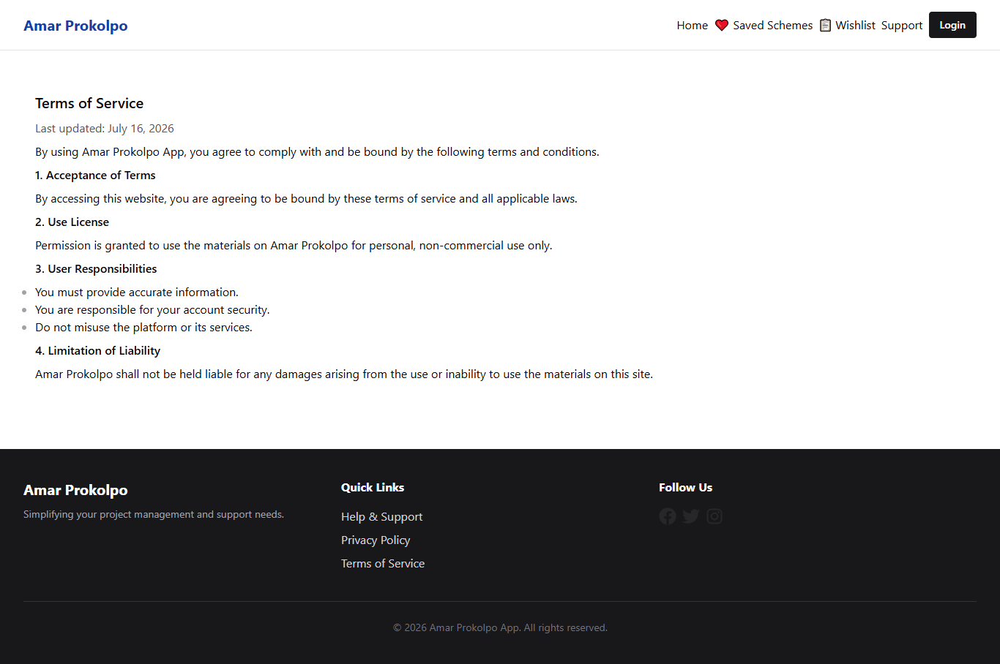
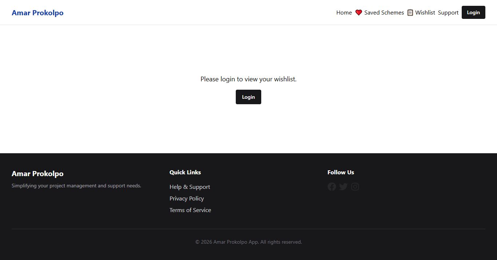
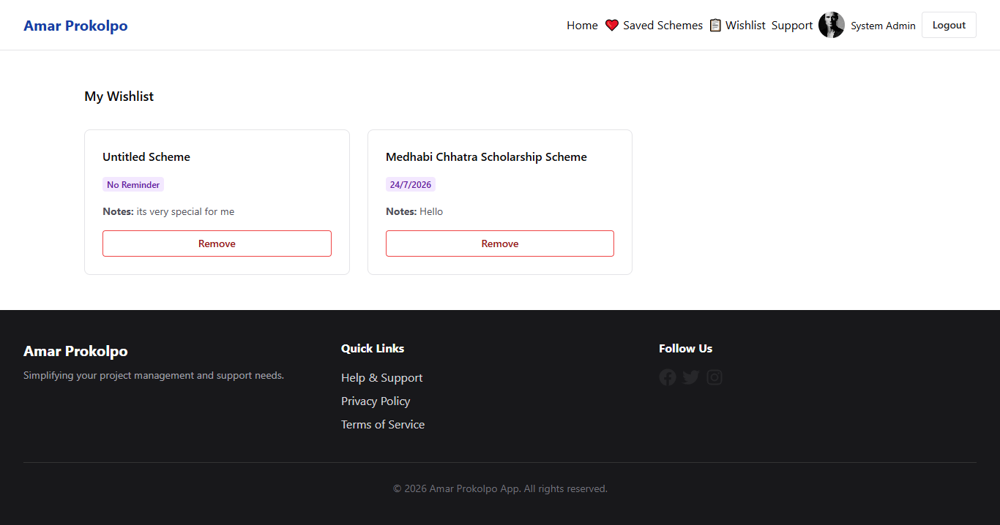

🚀 Overview
This repository manages a centralized database of government schemes, offering:

Centralized Data Management: Secure handling of scheme information.

Role-Based Access Control: Separate portals for users and administrators.

Cross-Platform Availability: Accessible via Web (Responsive) and Mobile (Android/iOS).

🛠️ Technology Stack
Backend Infrastructure
Core: Node.js & Express (Fast & Scalable API).

Database: MongoDB with Mongoose (Flexible schema design).

Security: JWT Authentication, Bcrypt (Password Hashing), CORS, Cookie-Parser.

Services: Cloudinary (Cloud Media Storage), Firebase Admin, Nodemailer (Notifications), Node-Cron (Automated tasks).

Monitoring: Winston (Structured logging for better debugging).

Frontend (Website & Admin Panel)
Core: React 19 (Vite build tool) with Redux Toolkit.

Styling (Website): Chakra UI & Sass (User-centric responsive design).

Styling (Admin): Tailwind CSS & Shadcn UI (Component-driven dashboard).

Form Logic: React Hook Form with Zod validation.

Mobile Application
Framework: Expo (React Native).

Navigation: Expo Router for seamless mobile transitions.

UX: React Native Reanimated & Gesture Handler for fluid animations.

📂 Project Structure
Plaintext
Amar-Prokolpo/
├── backend/          # RESTful API server & Business Logic
├── frontend/         # User Web Interface (Chakra UI)
├── admin-panel/      # Admin Management Dashboard (Shadcn/Tailwind)
└── mobileapp/        # Native Cross-platform Mobile App (Expo)
⚙️ Development Setup
1. Backend Setup
Bash
cd backend
npm install
# Setup .env (DB_URI, JWT_SECRET, CLOUDINARY_KEYS, etc.)
npm start
2. Frontend/Admin Setup
Bash
cd <frontend-or-admin-panel>
npm install
npm run dev
3. Mobile App Setup
Bash
cd mobileapp
npm install
npx expo start
🔑 Key Pillars
Security: Secured API endpoints using JWT and rigorous validation with express-validator and zod.

Scalability: Modular folder structure allowing independent deployment for each sub-project.

Performance: Fast build times with Vite and efficient data state management using Redux Toolkit.

👨‍💻 Developed by CheSubhro
Built with 💜 for a seamless experience.
